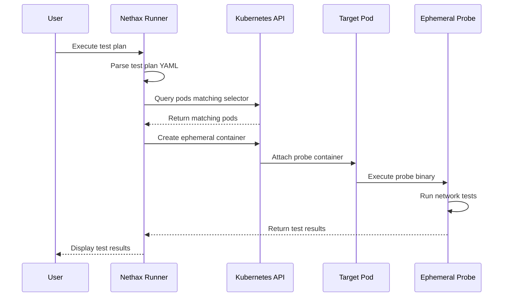

⚠️ This repo is currently in early development. ⚠️

# nethax
A testing toolkit for Kubernetes network engineers. Nethax makes connections from inside a Pod's network namespace in order to verify the network is operating as expected. This is useful for testing CNI and Network Policy configurations inside Kubernetes.

## Usage
For full usage instructions, please run:
```
nethax --help
```

## Overview
Nethax executes a network test plan within a pod for the purposes of testing within an application's network boundaries. It launches a small go binary as an ephemeral debug container inside a running pod which executes an HTTP(S) test, asserts the response code, and then exits. This can also be used for negative testing, where it is expected that a request times out or fails.

### How It Works



## Getting Started
See an example test plan at `example/OtelDemoTestPlan.yaml`.

Here's an example run:
```ShellSession
$ nethax execute-test -f example/OtelDemoTestPlan.yaml

Executing test plan: Otel Demo Test Plan
Description: Test plan for the opentelemetry demo application: https://github.com/open-telemetry/opentelemetry-demo

Executing tests for target: basic connectivity tests
  Pod Selector: mode: random, labels: app.kubernetes.io/instance=opentelemetry-demo
  Selected 1 ready pod(s) for testing
  Testing pod: otel-demo/frontend-6769b58884-vw62t
    Executing test: Check internet access
      Endpoint: https://grafana.com
      Test Type:
      Expected Status Code: 200
      Expect Fail: false
      Timeout: 5 seconds
      Result: PASSED

    Executing test: Check internal service
      Endpoint: http://otel-collector.otel-demo.svc.cluster.local:8888/metrics
      Test Type:
      Expected Status Code: 200
      Expect Fail: false
      Timeout: 3 seconds
      Result: PASSED

Executing tests for target: coredns connectivity tests
  Pod Selector: mode: all, labels: k8s-app=kube-dns
  Namespace: kube-system
  Selected 2 ready pod(s) for testing
  Testing pod: kube-system/coredns-7c65d6cfc9-dbrv8
    Executing test: Ensure fake service call fails
      Endpoint: http://fake-service.fake.svc.cluster.local/fake/healthz
      Test Type:
      Expected Status Code: 0
      Expect Fail: false
      Timeout: 3 seconds
      Result: PASSED

    Executing test: TCP service call
      Endpoint: fake-service.fake.svc.cluster.local:9001
      Test Type: tcp
      Expected Status Code: 0
      Expect Fail: true
      Timeout: 3 seconds
      Result: PASSED

  Testing pod: kube-system/coredns-7c65d6cfc9-hccns
    Executing test: Ensure fake service call fails
      Endpoint: http://fake-service.fake.svc.cluster.local/fake/healthz
      Test Type:
      Expected Status Code: 0
      Expect Fail: false
      Timeout: 3 seconds
      Result: PASSED

    Executing test: TCP service call
      Endpoint: fake-service.fake.svc.cluster.local:9001
      Test Type: tcp
      Expected Status Code: 0
      Expect Fail: true
      Timeout: 3 seconds
      Result: PASSED
```

### Exit codes

Nethax will perform the test and then return an exit code. Possible exit codes are:
```
exit 0 - success
exit 1 - failure
exit 2 - config error
exit 3 - nethax error
```
